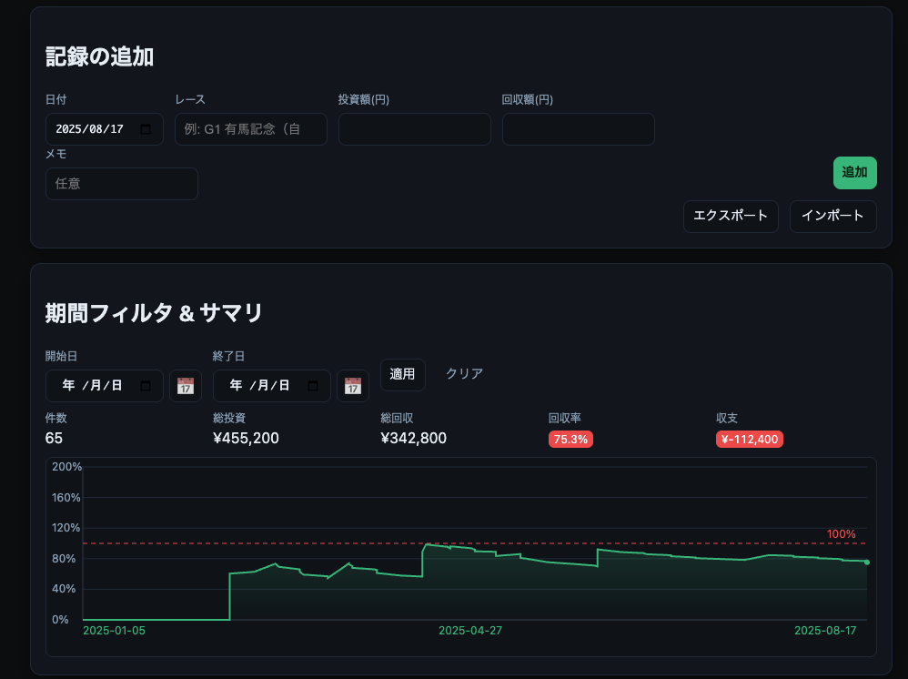
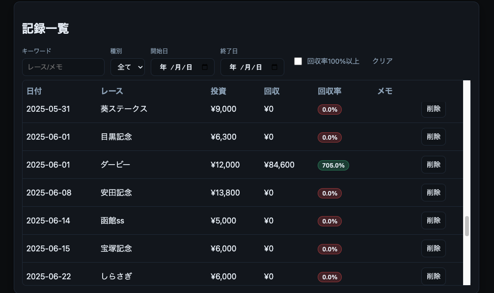
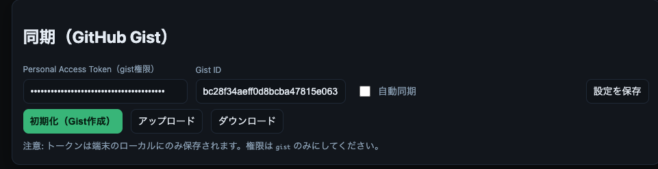

# 競馬 収支管理（重賞）

重賞（G1/G2/G3）を中心に、投資額・回収額・回収率・収支を手軽に記録・分析できるシンプルなフロントエンドアプリです。データはブラウザのローカルに保存され、JSON/CSVでバックアップ・移行ができます。PWA対応により、ホーム画面追加・オフライン起動が可能です。

## 主な機能
- 記録の追加: 日付、レース、投資額、回収額、メモ
- 一覧と操作: 並び替え（投資/回収/回収率）、フィルタ（キーワード/種別/G1-G3/日付/回収率100%）
- サマリ: 件数、総投資、総回収、回収率、収支の表示＋回収率の推移チャート
- インポート/エクスポート: JSON書き出し、JSON/CSV/TSV取り込み
- テーマ切替: ダーク/ライト
- PWA: ホーム画面に追加、オフライン起動（初回はオンラインでアクセスしてキャッシュ）

## データの保存
- 保存先: ブラウザの`localStorage`（キー: `keiba_roi_records_v1`）
- 端末/ブラウザごとに独立。履歴やサイトデータの削除で消える場合があります。
- バックアップ: 「エクスポート」でJSONを保存、「インポート」でJSON/CSVを読み込み可能。

## 使い方（ローカルで確認）
1. 任意のHTTPサーバで配信（例: Python）
   ```sh
   # プロジェクトの1つ上のディレクトリで
   python3 -m http.server 5173
   ```
2. ブラウザで `http://localhost:5173/keiba-roi/` を開く

※ `file:///` で直接開くとService Workerが動かず、PWA機能は使えません。

## デプロイ（GitHub Pages）
1. このディレクトリをGitHubへpush（例: `main`ブランチ）
2. GitHub リポジトリ → Settings → Pages
   - Source: 「Deploy from a branch」
   - Branch: `main` / `(root)` を選択 → Save
3. 数分後に `https://<ユーザー名>.github.io/keiba-roi/` が公開

## 同期（GitHub Gistを使用）
サーバ不要で、GitHubのGistを「クラウド保管場所」として同期できます。

1. GitHubでPersonal Access Tokenを発行（権限は`gist`のみ）
   - GitHub → Settings → Developer settings → Personal access tokens → Tokens (classic)
   - Noteを付け、Scopeは「gist」のみチェック
2. アプリ下部の「同期（GitHub Gist）」で以下を設定
   - Token: 上記トークン
   - Gist ID: 既存Gistを使う場合はそのID、未作成なら「初期化（Gist作成）」で新規作成
   - 自動同期: 起動時ダウンロード＋保存時に自動アップロード
3. ボタン
   - 初期化（Gist作成）: 現在のローカルデータを新規非公開Gistに作成し、Gist IDを保存
   - アップロード: ローカルの現在データをGistへ上書き
   - ダウンロード: Gistから取得してローカルへ上書き

注意
- トークンは端末の`localStorage`にのみ保存されます。共有端末では使用しないでください。
- トークンは`gist`権限のみにしてください。
- データファイル名は`keiba-roi-records.json`です。Gist側でこのファイルを編集/上書きしても問題ありません。

## スマホへのインストール（PWA）
- Android/Chrome: メニュー →「ホーム画面に追加」
- iOS/Safari: 共有ボタン →「ホーム画面に追加」
- 初回はオンラインで開き、アセットがキャッシュされるとオフラインでも起動できます。

## 画面イメージと説明
アプリの主な画面をまとめました。初めて使う方が操作の流れをイメージしやすいよう、用途とできることを簡潔に説明しています。

### 入力・サマリ
<p>
  
</p>

- 入力: 日付／レース（自由入力＋候補表示）／投資額／回収額／メモを入力し「追加」で即保存。
- バックアップ: 「エクスポート」でJSONを保存、「インポート」でJSON/CSVを読み込み。
- 期間集計: 期間フィルタを指定すると、件数・総投資・総回収・回収率・収支を自動集計。
- チャート: 回収率の推移をラインで可視化。マウスでポイントに追従（PC）。
- テーマ: 右上の「テーマ」からダーク/ライト切り替え。

### 記録一覧（分析）
<p>
  
</p>

- 並び替え: 「投資／回収／回収率」列のヘッダをクリックで昇順/降順切替。
- フィルタ: キーワード、種別（G1/G2/G3）、期間、回収率100%以上の条件で絞り込み。
- 表示: カード内で縦スクロール。ヘッダは固定で見やすく、各行の「削除」で個別削除。
- 表示強調: 回収率バッジでプラス（緑）/マイナス（赤）を一目で把握。

### 同期（GitHub Gist）
<p>
  
</p>

- 設定: Personal Access Token（gist権限）と Gist ID を登録。自動同期をONにすると起動時DL＋保存時UPを自動化。
- 操作: 「初期化（Gist作成）」「アップロード」「ダウンロード」で手動同期も可能。
- 取り扱い: トークンは端末のローカルにのみ保存。共有端末での利用は避けてください。

## CSV取り込みについて
- 区切り文字は自動判定（カンマ/タブ/セミコロン）
- ヘッダの同義語を幅広く許容（例）
  - 日付: `日付`, `date`, `日時`
  - レース: `レース`, `race`, `競走名`, `大会`, `レース名`
  - 投資額: `投資`, `投資額`, `bet`, `stake`, `購入`, `購入額`, `購入金額`
  - 回収額: `回収`, `回収額`, `払戻`, `払戻金`, `payout`, `return`, `払戻金額`
  - メモ: `メモ`, `memo`, `備考`, `note`
- サンプル: `template.csv` を参照

## 開発メモ
- ビルド不要の静的サイト構成（ES Modules）
- 主なファイル/ディレクトリ
  - `index.html`: 画面構造（`type="module"` で `js/main.js` を読み込み）
  - `styles/main.css`: 全体スタイル
  - `js/main.js`: 画面初期化・イベント・描画の統括
  - `js/utils.js`: 共通関数（`fmtYen`/`pct`/`escapeHtml`/`uid` など）
  - `js/csv.js`: CSV判定・パース・正規化
  - `js/races.js`: 重賞レース一覧（`RACE_LIST`）
  - `manifest.json`: PWAマニフェスト（名前/色/アイコン等）
  - `sw.js`: Service Worker（プリキャッシュ＋キャッシュファースト）
  - `icons/`: アイコン関連（`favicon.svg`/`icon-maskable.svg` と PNG）

### ディレクトリ構成（抜粋）
```
keiba-roi/
├─ index.html
├─ manifest.json
├─ sw.js
├─ styles/
│  └─ main.css
├─ js/
│  ├─ main.js
│  ├─ utils.js
│  ├─ csv.js
│  └─ races.js
├─ icons/
│  ├─ favicon.svg           # タブ用ファビコン
│  ├─ icon-maskable.svg     # PWAマスカブル（元デザイン）
│  ├─ icon-180.png          # iOS向け（ホーム追加）
│  ├─ icon-192.png          # Android/Manifest用
│  ├─ icon-512.png          # Android/Manifest用
│  └─ generate.html         # SVG→PNGを書き出す補助ページ
├─ template.csv
└─ README.md
```

### アイコンの更新（SVG→PNGの書き出し）
- 基本デザインは `icons/icon-maskable.svg`（角丸＋上向き矢印）
- PNGを更新するには、ローカルHTTPで以下を開く
  - 親ディレクトリで `python3 -m http.server 5173`
  - `http://localhost:5173/keiba-roi/icons/generate.html`
- 「3サイズを順に書き出し」で `icon-180.png`/`icon-192.png`/`icon-512.png` を生成して `icons/` に上書き保存
- 反映後は `sw.js` の `CACHE_NAME` をインクリメントして配信更新（PWAキャッシュ刷新）

## 注意事項
- iOSのプライベートブラウズ、あるいは一部の制限環境では`localStorage`やキャッシュが使えない場合があります。
- PWAの更新はバックグラウンドで取得され、次回起動時に反映されることがあります。
